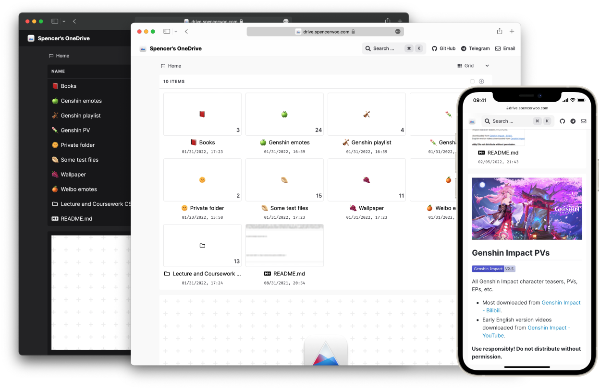

  
  <h3><a href="https://1drive.ai">onedrive-vercel-index</a></h3>
  
<em>OneDrive public directory listing, powered by Vercel and Next.js</em>

  
  
  

## TL;DR

Showcase, share, preview, and download files inside *your* OneDrive with onedrive-vercel-index -

- Completely free to host 💸
- Super fast ⚡ and responsive 💦
- Takes less than 15 minutes to setup ⏱️
- Highly customisable ⚒️

🍌 More importantly, we are pretty (●'◡'●)

## Quick start

🚀 Quick start: [Coming Soon].

## Demo

Live demo at [Reyyan's OneDrive](https://1drive.ai).

Here’s the table with the links removed:

## Features

<table>
  <tbody>
    <tr>
      <td>👀 File preview</td>
      <td>💠 List / Grid layouts</td>
      <td>🎥 Video and audio</td>
    </tr>
    <tr>
      <td>PDF, EPUB, markdown, code, plain text</td>
      <td>For previewing images and documents with thumbnails</td>
      <td>mp4, mp3, ..., play online or with IINA, PotPlayer ... with subtitles!</td>
    </tr>
    <tr>
      <td>📄 Office preview</td>
      <td>📝 README.md preview</td>
      <td>📑 Pagination</td>
    </tr>
    <tr>
      <td>docx, pptx, xlsx, ...</td>
      <td>Also renders code blocks, images with relative links, ...</td>
      <td>For folders with 200 or more items</td>
    </tr>
    <tr>
      <td>🔒 Protected folders</td>
      <td>⏬ Multi-file download</td>
      <td>🔎 Native Search</td>
    </tr>
    <tr>
      <td>Password-protected routes and files.</td>
      <td>Compress and download multiple files or folders.</td>
      <td>Searching through your shared OneDrive files (with some caveats 🥺).</td>
    </tr>
  </tbody>
</table>

... and more:

- Streamlined deployment, without having to get your tokens manually anymore!
- Direct raw-file serving and hosting ...
- Full dark mode support, style and website customisations ...

> **Note**: This project is focused on showcasing and providing a way for others to download files from your OneDrive. Emphasis on **free** and **serverless**. If you have your own server / need WebDAV / use cloud providers other than OneDrive, checkout [alist](https://github.com/alist-org/alist).

## Server-*less* (free)?

Yes! Completely free with no backend server what-so-ever. (Well, we use Redis, but that's free to some extent also.)

## License

[MIT](LICENSE)

  
  <em>made with ❤️ by <a href="https://www.linkedin.com/in/reyyanxahmed/">Reyyan Ahmed</a></em>

